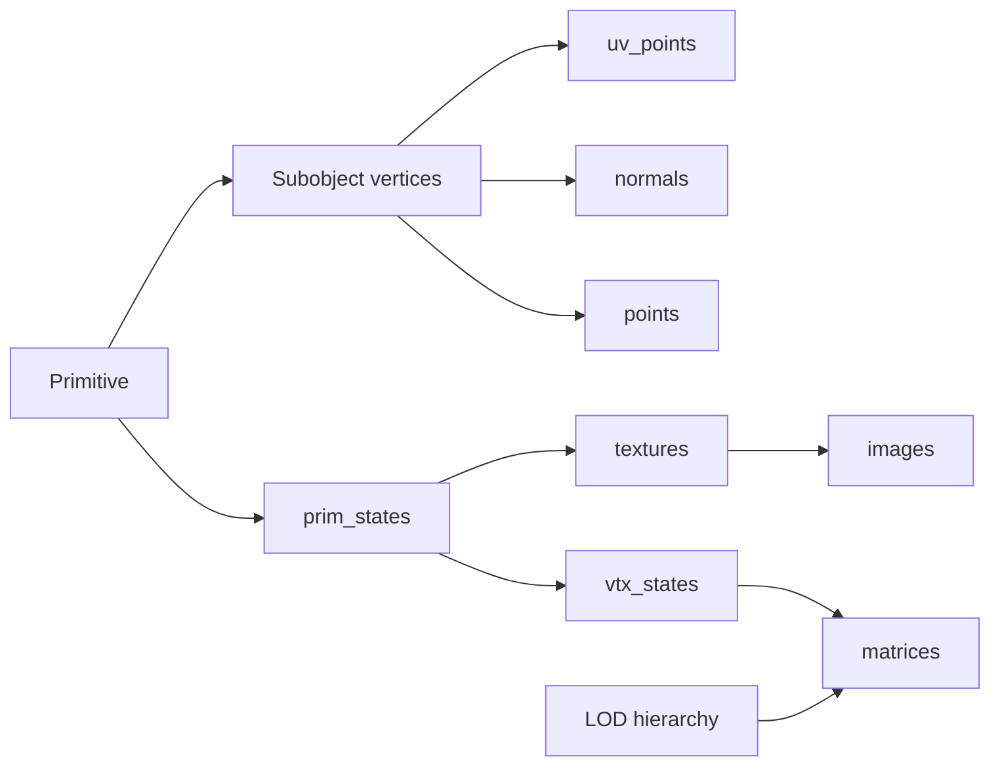

# MSTS shape file format: structure, blocks and fields

Version 1 shape format (`.s`) and companion descriptor (`.sd`). Updated: 2026-09-13.

An MSTS shape file describes a model through shared coordinate, transform and material tables, distance-dependent geometry, and optional animation and named-geometry records. A companion descriptor supplies metadata such as bounds and alternative-texture availability.

This reference specifies block structure, field order, scalar types and known relationships. It covers all 94 concrete block productions in the original shape grammar and separately identifies observed variants and descriptor extensions. It is a working technical reference, not a complete account of every historical extension or native rendering rule.

**Unknown** marks a field meaning or value domain that has not been established. **Inferred** marks a provisional interpretation. **Variant** identifies a layout that differs from another documented form. A known field width does not imply known semantics; unknown values and optional presence remain significant.

The format description comes first. [Implementation behavior and differences](#implementation-behavior-and-differences) follows the field catalogue; [references and evidence](#references-and-evidence) closes the document.

## Notation and scalar encoding

Fields are listed in file order. Grammar categories such as `uv_op`, `controller`, `prim_item` and `FILE` are not separate serialized blocks. `[]` means optional presence, `{}` means repeated content, and `child` means a nested block with the named keyword. Every block can also have a header label, which is outside these body-field lists.

| Type | Text representation | Binary representation |
|---|---|---|
| `u` | Unsigned decimal integer | Little-endian unsigned 32-bit word |
| `i` | Signed decimal integer | Little-endian signed 32-bit word |
| `h` | Hexadecimal DWORD/flags, often eight digits | Little-endian 32-bit bit pattern |
| `f` | Floating-point literal | Little-endian IEEE-754 float32 |
| `s` | String, quoted when required | 16-bit little-endian UTF-16 code-unit count followed by UTF-16LE units |
| `token` | Callback identifier; exact text naming rules remain unknown | Provisionally represented as a 32-bit word; native callback encoding needs confirmation |

Indices normally refer to zero-based entries in another table. Signed references can use negative sentinels: for example `hierarchy` uses `-1` for no parent. Do not apply one global negative-index rule to all fields. Counts are scalar values in the file, not delimiters; block boundaries still determine where a record ends. Some counts describe logical records rather than scalar words: the observed triangle form of `normal_idxs` contains two words per declared record. `primitives` counts state-change and draw commands in the observed writer convention.

## SIMIS envelope and binary block framing

Uncompressed binary representation begins with the 16-byte ASCII envelope `SIMISA@@@@@@@@@@`, followed by the 16-byte shape subheader `JINX0s1b________`. The first block starts at byte 32. The UTF-16 text representation uses a UTF-16LE BOM and `SIMISA@@@@@@@@@@JINX0s1t______`, followed by whitespace and the textual blocks. The `s` identifies shape content, `1` the version and `b`/`t` the representation. Descriptor text uses file kind `D`. Do not infer representation merely from a `.s` extension.

The narrow compressed envelope is `SIMISA@F`, a little-endian 32-bit inflated byte count, four padding bytes, then a zlib stream at byte 16. Inflation yields the subheader and body; it does not yield another complete outer envelope. The Unicode compressed variant starts with BOM, eight UTF-16LE characters `SIMISA@F`, the 32-bit inflated byte count at offset 18, twelve padding bytes, and the zlib stream at offset 34. Its inflated bytes begin with the UTF-16 subheader. Compression and text/binary representation are separate choices. These offsets describe the envelope forms covered here; other historical variants remain outside the confirmed layout.

Each binary block is:

| Relative offset | Field | Meaning |
|---|---|---|
| 0 | `u tokenId` | Complete 32-bit identifier: namespace in the upper 16 bits, local ID in the lower 16 bits. Preserve both halves. |
| 4 | `u payloadBytes` | Number of bytes after the eight-byte header, including label length, label and body |
| 8 | `uint8 labelUnits` | Label length in UTF-16 code units, 0–255 |
| 9 | UTF-16LE label | Exactly `labelUnits × 2` bytes; no terminating NUL |
| variable | Body | Typed scalar fields and nested blocks, according to the keyword/context |

Child lengths must fit their parent. Binary scalar strings have a **16-bit** length; block labels have an **8-bit** length. Unknown binary bodies cannot be safely treated as lists of child blocks because their scalar layout is unknown.

## Text blocks and labels

A block header has the form `keyword [label] ( body )`. For example:

```text
matrix "door left" ( 1 0 0 0 1 0 0 0 1 0 0 0 )
image ( "body.ace" )
```

Here `door left` is a label and `body.ace` is a body string. Labels are structurally available on any block; they are not restricted to uppercase text or to names outside the token table. Common meaningful labels occur on `matrix`, `anim_node` and `prim_state`. Their interpretation belongs to the consumer: named animation conventions are not another serialized field.

The format reader must know whether it expects a scalar or a child block. Scanning arbitrary text to the next `(` is ambiguous, especially in `.sd` where the root contains a filename before its child blocks. Keyword recognition is case-insensitive; label normalization/matching depends on the consumer. Preserve the full label in storage.

## Overall structure and table relationships

The conventional root structure is:

```text
shape
  shape_header
  volumes
  shader_names
  texture_filter_names
  points
  uv_points
  normals
  sort_vectors
  colours
  matrices
  images
  textures
  light_materials
  light_model_cfgs
  vtx_states
  prim_states
  lod_controls
  [animations]
  [shape_named_data]
```

Empty tables are possible. Optional root sections are marked above. Table entry order, indices and primitive state-change order have meaning and cannot be rearranged independently. Acceptance of other section orders is not established for every consumer.



Geometry tables and materials are shared at shape scope. Each LOD contains subobjects with their own vertex records and draw primitives. A vertex is a set of references, not a duplicate point coordinate. The indexed model is the source representation; expanded rendering buffers are derived data.

## Counted tables

Every table below starts with one `u count`, followed by the listed entries. There are no other scalar prefix fields. Meanings of the entries are defined in subsequent sections.

| Block | Repeated entry | Count means |
|---|---|---|
| `volumes` | `vol_sphere` | Spheres |
| `shader_names` | `named_shader` | Shader names |
| `texture_filter_names` | `named_filter_mode` | Filter names |
| `points` | `point` | Positions |
| `uv_points` | `uv_point` | UV coordinate pairs |
| `normals` | `vector` | Normal vectors |
| `sort_vectors` | `vector` | Sorting vectors |
| `colours` | `colour` | Colour entries |
| `matrices` | `matrix` | Transform entries |
| `images` | `image` | Image filenames |
| `textures` | `texture` | Texture definitions |
| `light_materials` | `light_material` | Lighting materials |
| `light_model_cfgs` | `light_model_cfg` | Lighting configurations |
| `uv_ops` | One of the UV-operation blocks | Operations |
| `vtx_states` | `vtx_state` | Vertex states |
| `prim_states` | `prim_state` | Primitive states |
| `vertices` | `vertex` | Subobject vertex records |
| `vertex_sets` | `vertex_set` | Vertex ranges |
| `geometry_nodes` | `geometry_node` | Geometry nodes |
| `sub_objects` | `sub_object` | Subobjects in this LOD |
| `distance_levels` | `distance_level` | Distance levels in one control |
| `lod_controls` | `lod_control` | LOD controls |
| `animations` | `animation` | Animations |
| `anim_nodes` | `anim_node` | Animated nodes |
| `controllers` | Controller blocks | Controllers in this node |
| `tcb_rot`, `tcb_pos`, `linear_pos` | Animation keys; see animation section | Keys |

`primitives`, numeric arrays, and the alternate `slerp_rot` container have separate count rules below. `shape_named_data` starts with a child header, not a scalar count.

## Header, bounds and coordinate tables

| Block | Ordered body fields | Meaning / unresolved details |
|---|---|---|
| `shape_header` | `h flags1`, `[h flags2]` | Global flags. Individual bits and the meaning of omitted versus zero `flags2` remain unknown. |
| `vector` | `f X`, `f Y`, `f Z` | Meaning follows parent: normal, sorting vector or sphere centre. |
| `vol_sphere` | `vector` child, `f radius` | Bounding sphere centre and radius. Exact native culling policy remains unverified. |
| `point` | `f X`, `f Y`, `f Z` | Shape-space position, conventionally in metres. |
| `uv_point` | `f U`, `f V` | Texture coordinates; wrapping/origin treatment also depends on renderer and image conventions. |
| `colour` | `f A`, `f R`, `f G`, `f B` | Alpha first in the file, followed by red, green and blue. Do not confuse this with in-memory RGBA ordering. |
| `matrix` | Twelve `f`: `M11 M12 M13 M21 M22 M23 M31 M32 M33 M41 M42 M43` | Affine transform: three basis rows followed by translation. The fourth column is implicit in a homogeneous representation. Header label identifies the transform. |

`hierarchy` supplies parent relationships per LOD, outside `matrix`. Native root-transform exceptions, multiplication conventions, sorting policy for `sort_vectors`, normal-vector normalization requirements and the complete set of matrix-name animation conventions remain to be established.

## Shaders, textures and lighting

| Block | Ordered body fields | Meaning / unresolved details |
|---|---|---|
| `named_shader` | `s shaderName` | Shader identifier such as `TexDiff`. Full shader-name catalogue and native equations remain to be documented. This is not a block label. |
| `named_filter_mode` | `s filterName` | Named texture filtering mode. Referenced by texture `FilterMode` in the observed table-index convention. The complete filter catalogue remains unknown. |
| `image` | `s filename` | Image path/name. Resolution uses the caller's texture root and possible seasonal/shared directories. |
| `texture` | `u ImageIdx`, `u FilterMode`, `f MipMapLODBias`, `[h BorderColour]` | Image-table reference, filtering selector, mip-level bias and optional packed border colour. Observed `FilterMode` values index `texture_filter_names`. The full native filter catalogue and border-colour packing/usage remain unverified. |
| `light_material` | `h flags`, `u DiffColIdx`, `u AmbColIdx`, `u SpecColIdx`, `u EmissiveColIdx`, `f SpecPower` | Four indices into `colours`: diffuse, ambient, specular, emissive; specular exponent/power. Flag bits and complete native lighting equations unknown. |
| `light_model_cfg` | `h flags`, `uv_ops` child | Lighting/UV configuration. Flag meanings unknown; operation layouts are below. |
| `vtx_state` | `h flags`, `u MatrixIdx`, `i LightMatIdx`, `u LightCfgIdx`, `h LightFlags`, `[i matrix2]` | Transform index, lighting-material selector, lighting-config index, lighting flags, optional second matrix. Negative `LightMatIdx` values select special lighting behavior; complete enum unknown. Second-matrix/blending semantics and flag bits need confirmation. |
| `prim_state` | `h flags`, `u ShaderIdx`, `tex_idxs` child, `f ZBias`, `i VertStateIdx`, `[u alphatestmode]`, `[u LightCfgIdx]`, `[u ZBufMode]` | Shader and vertex-state references; texture references; depth bias, alpha-test, lighting-config and depth-buffer selectors. Header label is a material/state name. Native flags, enum domains, depth-bias units/sign and precedence between the two lighting-config references remain unresolved. |

Optional trailing fields retain their presence independently of value: omitted and explicitly zero are not automatically interchangeable. Complete flag/enum domains and shader equations remain unknown.

### UV-operation catalogue

All fifteen concrete UV operations are listed below. `TexAddrMode` is a `u` texture-addressing selector; its complete native value domain remains unverified. `SrcUVIdx` selects a source UV channel, not directly a global `uv_points` entry. Exact channel limits and native operation formulas remain to be established.

| Block | Ordered body fields | Interpretation / unknowns |
|---|---|---|
| `uv_op_share` | `u TexAddrMode`, `u UvOpIdx` | Reuses another UV operation; scope and allowed ordering of the reference unknown. |
| `uv_op_copy` | `u TexAddrMode`, `u SrcUVIdx` | Copies a source UV channel. |
| `uvop_copy` | `u IgnoredValue` | Distinct historical spelling/layout. Grammar calls the value ignored; native significance not independently verified. |
| `uv_op_uniformscale` | `u TexAddrMode`, `u SrcUVIdx`, `f Scale` | Uniform UV scale. |
| `uv_op_nonuniformscale` | `u TexAddrMode`, `u SrcUVIdx`, `f UScale`, `f VScale` | Separate U/V scales. |
| `uv_op_transform` | `u TexAddrMode`, `u SrcUVIdx`, six `f`: `e11 e12 e21 e22 e31 e32` | Affine UV transform; precise multiplication convention unverified. |
| `uv_op_user_uninformscale` | `u TexAddrMode`, `u SrcUVIdx`, `token CallbackToken` | Callback-driven uniform scale; callback identifiers/dispatch unknown. Spelling is intentional. |
| `uv_op_user_nonuninformscale` | `u TexAddrMode`, `u SrcUVIdx`, `token CallbackToken` | Callback-driven nonuniform scale; identifiers/dispatch unknown. Spelling is intentional. |
| `uv_op_user_transform` | `u TexAddrMode`, `u SrcUVIdx`, `token CallbackToken` | Callback-driven transform; identifiers/dispatch unknown. |
| `uv_op_reflectmap` | `u TexAddrMode` | Reflection mapping; projection and coordinate-space rules unknown. |
| `uv_op_reflectmapfull` | `u TexAddrMode` | Reflection mapping variant; distinction from reflectmap unknown. |
| `uv_op_spheremap` | `u TexAddrMode` | Sphere mapping; native formula unknown. |
| `uv_op_spheremapfull` | `u TexAddrMode` | Sphere-map variant; distinction from spheremap unknown. |
| `uv_op_specularmap` | `u TexAddrMode` | Specular mapping; native formula unknown. |
| `uv_op_embossbump` | `u TexAddrMode`, `u SrcUVIdx`, `f UVShiftScale` | Emboss/bump UV shift scale; light direction and combination rules unknown. |

## LOD and subobject structure

| Block | Ordered body fields | Meaning / unresolved details |
|---|---|---|
| `lod_control` | `distance_levels_header`, `distance_levels` | One LOD control; native interaction between multiple controls needs confirmation. |
| `distance_levels_header` | `u DlevBias`, `[f DlevScale]` | Bias and optional scale used by LOD selection. Exact native formula unknown. |
| `distance_level` | `distance_level_header`, `sub_objects` | One detail level. |
| `distance_level_header` | `dlevel_selection`, `hierarchy` | Visibility distance and transform parents. |
| `dlevel_selection` | `f VisibleDistance` | Distance threshold, conventionally metres. Exact comparison boundary, bias/scale and selection policy need confirmation. |
| `sub_object` | `sub_object_header`, `vertices`, `vertex_sets`, `primitives` | One drawable subobject within a level. |
| `sub_object_header` | `h flags`, `i SortVectorIdx`, `i VolIdx`, `h SrcVtxFmtFlags`, `h DstVtxFmtFlags`, `geometry_info`, `[subobject_shaders]`, `[subobject_light_cfgs]`, `[u SubObjID]` | Sorting-vector and volume references; source/destination vertex-format masks; geometry metadata; optional resource lists and identifier. Masks, sentinel rules and full SubObjID semantics unknown. |

`SubObjID` is a scalar suffix, not an additional child block. Do not equate it automatically with the subobject's ordinal index or a consumer's visibility-mask bit.

### Geometry command metadata

`geometry_info` has an observed layout of **ten `u` counters**, followed by `geometry_nodes` and `geometry_node_map`. The provisional positional names are:

| Position | Name | Meaning / confidence |
|---|---|---|
| 0 | `FaceNormals` | Face-normal count; exact accounting unknown |
| 1 | `TxLightCmds` | Transform/lighting command count, inferred from name |
| 2 | `NodeXTxLightCmds` | Node-related transform/lighting count; uncertain attribution |
| 3 | `TrilistIdxs` | Triangle-list index count; accounting unknown |
| 4 | `LineListIdxs` | Line-list index count; accounting unknown |
| 5 | `NodeXTrilistIdxs` | Node-related triangle index count; accounting unknown |
| 6 | `Trilists` | Triangle-list count; accounting unknown |
| 7 | `LineLists` | Line-list count; accounting unknown |
| 8 | `PtLists` | Point-list count; accounting unknown |
| 9 | `NodeXTrilists` | Node-related triangle-list count; accounting unknown |

**Layout uncertainty:** the published grammar lists eleven counters with a duplicated name, while the observed binary-reader/writer layout contains ten. The table above describes the ten-word form; the disputed names and possible historical variants require confirmation. Do not insert an eleventh word solely to match the published production.

| Block | Ordered body fields | Meaning / unresolved details |
|---|---|---|
| `geometry_node` | Five `u`: `TxLightCmds`, `NodeXTxLightCmds`, `TriLists`, `LineLists`, `PtLists`; then `cullable_prims` | Per-node counters. Exact counting and `NodeX` meaning unknown. |
| `cullable_prims` | `u NumPrims`, `u NumFlatSections`, `u NumPrimIdxs` | Culling-related counts. Meaning of flat section and native culling algorithm unknown. |

`geometry_node_map` is matrix-indexed in the observed convention: each entry identifies a geometry node, or `-1` when that matrix has none in this subobject. Other sentinel values and historical map variants remain unknown.

## Vertices, primitive commands and numeric arrays

| Block | Ordered body fields | Meaning / unresolved details |
|---|---|---|
| `vertex` | `h flags`, `u PointIdx`, `u NormalIdx`, `h Colour1`, `h Colour2`, `vertex_uvs`, `[f weight]` | References into shape positions/normals; two packed colours; UV-channel references; optional blend weight. Colour packing/channel roles, flag bits and relation between weight and `matrix2` require native confirmation. |
| `vertex_set` | `u VtxStateIdx`, `u StartVtxIdx`, `u VtxCount` | Vertex-state index and contiguous range in this subobject's vertex table. |
| `primitives` | `u NumPrims`, ordered primitive/state-change blocks | Stream of `prim_state_idx`, `indexed_trilist`, `indexed_line_list`, `point_list`. Observed count convention: emitted draw blocks plus state-change blocks. Do not confuse this count with triangle-list count or triangle count. Inconsistent input counts still require bounded parsing. |
| `prim_state_idx` | `u index` | Selects a `prim_states` entry for following draw commands. State-change order is significant. |
| `indexed_trilist` | `vertex_idxs`, `normal_idxs`, `flags` | Indexed triangles plus normal/face metadata. Vertex indices refer to this subobject's `vertices`. |
| `indexed_line_list` | `vertex_idxs` | Indexed lines; consecutive pairs identify segment endpoints. |
| `point_list` | `u FirstVertIdx`, `u NumVtxs` | Contiguous vertex range rendered as points. |

Triangle vertex indices group into triples; the count in `vertex_idxs` counts indices, not triangles. The observed triangle-normal form is a `(normal-table index, 3)` pair per triangle and one face flag per triangle. The second word may describe the associated vertex count, but its general meaning and other normal-record forms remain unverified. Face-normal records and face flags are independent of the per-vertex normal references.

Every numeric-array block below has `u count` followed by scalar data, without one child block per entry. **The count can count records: `normal_idxs` uses two words per record in the observed triangle form.**

| Block | Entry type | Reference/value meaning |
|---|---|---|
| `tex_idxs` | `u` | Indices into `textures` |
| `vertex_idxs` | `u` | Local subobject vertex indices |
| `normal_idxs` | `u` | Observed triangle form: count is number of records; each record is two `u` words, normal-table index then `3`. Other forms/native semantics unresolved |
| `flags` | `h` | Face flags; bit meanings unknown |
| `vertex_uvs` | `u` | Indices into global `uv_points`, one per source UV channel |
| `hierarchy` | `i` | Parent matrix index per matrix, `-1` for root/no parent |
| `geometry_node_map` | `i` | Geometry-node mapping; exact native mapping rules unresolved |
| `subobject_shaders` | `u` | Shader references used by this subobject |
| `subobject_light_cfgs` | `u` | Lighting-configuration references used by this subobject |

Avoid assuming `normal_idxs` and `flags` contain exactly as many scalar words as vertex indices. The file declarations and actual bounded payloads must be examined independently.

## Animation blocks and keys

| Block | Ordered body fields | Meaning / unresolved details |
|---|---|---|
| `animation` | `u num_frames`, `u frame_rate`, `anim_nodes` | Timeline length and frames per second. Loop endpoint and interpolation policy are consumer behavior needing native validation. |
| `anim_node` | `controllers` | Label names the animated node. Exact name-versus-index binding rules and hardcoded animation conventions require confirmation. |
| `linear_pos` | `u num_keys`, repeated `linear_key` | Linear position track. |
| `tcb_pos` | `u num_keys`, repeated `tcb_key` | TCB position track; native role of its fourth component needs confirmation. |
| `tcb_rot` | `u num_keys`, repeated `tcb_key` or observed direct `slerp_rot` keys | Rotation track. |
| `linear_key` | `u frame`, `f x`, `f y`, `f z` | Frame and position components. |
| `tcb_key` | `u frame`, `f x`, `f y`, `f z`, `f w`, `f tension`, `f continuity`, `f bias`, `f in`, `f out` | Four value components and TCB/easing parameters. For rotation, readers use quaternion components. Exact native interpolation, easing ranges and rotation conventions remain to be verified. |
| `slerp_rot` — direct key | `u frame`, `f x`, `f y`, `f z`, `f w` | Observed quaternion-key variant; binary scalar body is 20 bytes after the label. |
| `slerp_rot` — grammar form | `u num_keys`, repeated `linear_key` | The published grammar describes a controller containing three-component keys. Interpretation as rotation is unresolved; do not invent a missing quaternion component. |

The two `slerp_rot` forms differ structurally: one is a quaternion key, the other a controller containing vector keys. Their interchangeability is not established. Full TCB weighting, easing ranges, quaternion conventions and endpoint behavior remain open questions.

## Named geometry

| Block | Ordered body fields | Meaning / unresolved details |
|---|---|---|
| `shape_named_data` | `shape_named_data_header`, `shape_named_geometry` records | Named geometry collection. The published grammar specifies one geometry child despite a name count; native multiplicity and usage remain unconfirmed. |
| `shape_named_data_header` | `u NumNames` | Declared number of names |
| `shape_named_geometry` | `s name`, `u NumRefs`, repeated `shape_geom_ref` | Name string and references. Name is in the body, not necessarily the block label. |
| `shape_geom_ref` | `u type`, `u DlevIdx`, `u SubObjIdx`, `u first`, `u n` | Reference type, distance-level index, subobject index and range. Type enum, range units and multi-LOD-control scope unknown. |

## `.sd` shape descriptor companion

A descriptor is a separate document, conventionally `model.sd` beside `model.s`. Its root is also named `shape`, but **its first body item is a filename string**, followed by descriptor blocks:

```text
shape ( "model.s"
    ESD_Detail_Level ( 0 )
    ESD_Bounding_Box ( -1 0 -2 1 3 2 )
)
```

The descriptor root has a mixed scalar/child body, unlike the `.s` root. The following catalogue covers common fields and partially understood compound bounds. Application extensions are listed with implementation differences below; unknown third-party blocks remain outside this inventory.

| Block | Body fields | Meaning / unknowns |
|---|---|---|
| `ESD_Detail_Level` | One integer | Detail classification. Complete native value range and application policy unknown. |
| `ESD_Alternative_Texture` | One integer bitmask | Alternative/seasonal texture availability. Full native bit catalogue and precedence remain to be confirmed. |
| `ESD_Bounding_Box` | Six `f`: minimum X/Y/Z, maximum X/Y/Z | Axis-aligned bounds. Empty blocks occur; missing bounds are not automatically fatal. |
| `ESD_Complex` | `ESD_Complex_Box` children | Compound bounds. Full grammar/count variants need further evidence. |
| `ESD_Complex_Box` | Twelve `f` in source order | Observed twelve-value form. Values 6–11 are interpreted as bounds; meanings, units and orientation convention of values 0–5 remain unverified. |
| `ESD_Snapable` | Empty marker or boolean value | Snap capability. Presence-only versus explicit-false semantics vary by consumer. |
| `ESD_No_Visual_Obstruction` | Boolean or empty marker | Obstruction-related flag. Native use and empty-marker default not established here. |
| `ESD_SubObj` | Presence marker; payload unspecified | Subobject flag; detailed payload/native behavior unknown. |

## Unresolved format questions

The following parts of the format remain unresolved:

1. Resolve the `geometry_info` ten/eleven-counter discrepancy, positional names and count accounting; determine geometry-node mapping and `NodeX` meaning.
2. Resolve both `slerp_rot` layouts and native TCB/easing, quaternion, root-matrix and animation-name conventions.
3. Identify flag bits and enum values for headers, vertex formats, materials, lighting codes, alpha/depth modes, filtering/addressing, face flags and named-geometry reference types.
4. Determine UV callback IDs, transform conventions and native UV-operation equations.
5. Establish second-matrix/weight behavior, colour packing and the two vertex colour channels.
6. Generalize beyond the observed triangle normal pairs and state-inclusive primitive counts: verify native record semantics and line/point families.
7. Confirm LOD bias/scale, multiple controls, SubObjID semantics, sorting and culling.
8. Complete `.sd` complex-box semantics, seasonal flags, boolean-presence differences and extensions.

For each finding, record the evidence source and distinguish static native-code observations from executable behavior, corpus examples and modern-reader assumptions. A successful render alone does not explain an unused field.

## Implementation behavior and differences

This section records how the reviewed applications interpret or produce the format. Their behavior does not define all valid files or establish native semantics for unknown fields. Sources and pinned observations are listed in the closing references.

### TSRE

SFileLegacy is the default rendering loader; original SFile/C/X remains an explicit fallback. SFileComplex Complete retains editable source data, including unsupported fields. Compact omits data not required for rendering and requires a full Complete reload before saving. Retention, source health and GL readiness are application states, not serialized shape fields.

SFileComplex uses typed numeric storage. Known text numbers normalize to native 32-bit types; comments, spacing and original numeric spelling are not retained. Binary float bits are preserved. Same-encoding unknown records and extra payloads are retained where their boundaries are known. Cross-encoding conversion fails when an unknown layout cannot be converted losslessly. Partial or structurally damaged documents refuse saving; normalized serialization is not a repair operation.

CPU loading retains source indices separately from GL expansion. Rendering mirrors coordinates and reverses primitive winding according to TSRE's existing conventions. Source matrices and indices retain file values. Bounds can be queried after CPU loading, before GL initialization.

The Complex renderer uses the first texture/UV channel, a subset of material/lighting behavior, and its implemented position/quaternion interpolation. Full TCB weighting and the complete UV-operation family are preserved but not evaluated. Named geometry is retained without a rendering consumer. Current animation-channel association follows node/matrix indices; full native name-based animation rules remain unverified.

The document reader accepts missing/extra blocks and resolves rendering dependencies without requiring their sections to appear first. A known static-data problem can make the runtime shape Broken without discarding inspectable source storage. Framing damage confined to animations can instead produce Recovered static geometry with runtime animations discarded; this does not make the damaged source saveable.

At recognized text block headers, unquoted multi-word labels can be joined with a diagnostic and quoted on save. This bounded compatibility extension is not evidence that native MSTS accepts the same invalid syntax. Binary `slerp_rot` with 20 body bytes after the label is recognized as a direct quaternion key; the alternate container is also retained.

Descriptor differences are explicit: `ESD_Detail_Level` and `ESD_Alternative_Texture` have unsigned typed layouts in the document; seasonal paths use TSRE's season flags. All twelve complex-box values survive Complete storage, while current bounds helpers use values 6–11. `ESD_Snapable` currently tests block presence, so an explicit false value is not equivalent to absence. Unknown text descriptor extensions are retained without implying a typed binary schema or runtime support.

### Open Rails

The reviewed shape reader accepts direct `slerp_rot(frame,x,y,z,w)` children within `tcb_rot`. Its model declares ten `geometry_info` counters, but its constructor assigns both positions 2 and 5 to `NodeXTrilistIdxs`, leaving the declared `NodeXTxLightCmds` unassigned. This is an implementation inconsistency; it does not settle the grammar's eleven-counter discrepancy or the disputed field meanings.

The generic header reader consumes one label. Its recovery can skip an unexpected suffix before an opening bracket, losing part of an unquoted multi-word name. Thus a shape loading successfully does not prove that all its labels survived.

The reviewed descriptor reader accepts booleans for `ESD_Snapable` and `ESD_No_Visual_Obstruction`, with empty blocks interpreted as true. `ESD_SubObj` sets a presence flag and skips its body. It also recognizes the following application extensions:

| Block | Body fields | Open Rails interpretation |
|---|---|---|
| `ESD_ORTSSoundFilename` | String | Sound-file reference |
| `ESD_ORTSBellAnimationFPS` | Frequency scalar | Stored in the custom animation-rate field |
| `ESD_ORTSCustomAnimationFPS` | Frequency scalar | Same field as the bell alias; last parsed assignment takes precedence |

These extensions are not entries in the original shape grammar and do not imply corresponding TSRE runtime support.

### Blender MSTS/ORTS exporter

The reviewed exporter provides concrete writer evidence. Its supported paths are a subset of the format, and its defaults are not universal required values.

#### Geometry and counts

For triangle output it writes:

- `vertex_idxs`: three indices per triangle.
- `normal_idxs`: one declared record per triangle, containing `(normal index, 3)`. Face normals are transformed and normalized; a source comment attributes them to MSTS culling. The second word's general native meaning remains uncertain.
- `flags`: one zero DWORD per triangle.
- `primitives`: one count per emitted draw or `prim_state_idx` command. Redundant consecutive state changes are suppressed.

Its ten `geometry_info` words are `[triangles, nonempty vertex sets, 0, 3 × triangles, 0, 0, triangle lists, 0, 0, 0]`. It creates one geometry node for each matrix used by the subobject, and a matrix-indexed map to those nodes with `-1` for unused matrices. Each node's first counter counts distinct referenced vertex states; its other four counters are zero. Per-matrix `cullable_prims` is `[triangle lists, triangles, 3 × triangles]`. This makes triangle count a concrete use of the `NumFlatSections` position without proving its general meaning.

#### Lighting, textures and flags

| Exporter lighting choice | `LightMatIdx` |
|---|---:|
| Normal / emissive | -5 |
| Specular 25 | -6 |
| Specular 750 | -7 |
| Full bright | -8 |
| Cruciform | -9 |
| Half bright | -11 |
| Dark | -12 |

Opaque normal materials use `TexDiff`; nonopaque normal materials use `BlendATexDiff`. Emissive choices use `Tex` / `BlendATex`, while retaining lighting code -5. Clip mode sets `alphatestmode=1`; opaque/blended modes set 0. `ZBufMode` defaults to 1. These are exporter choices, not a complete native shader/lighting specification.

The second `texture` field is assigned an index into `texture_filter_names`, normally `MipLinear`. The active UV-copy path uses address mode 1 for repeat. Source comments identify 2 as mirror, 3 as edge extension and 4 as border clamping; those comments do not establish that the corresponding paths were exercised.

Ordinary subobjects use flags `0x400` and sort-vector/volume references `-1/-1`; alpha-sorted subobjects use `0x500` and `0/0`. Specular choices clear bit `0x400`. These correlations are useful research leads, not complete bit definitions. The writer orders ordinary, alpha-blended and alpha-sorted subobjects in that sequence. Its priority is not a serialized field. SubObjID is zero, vertex colours default to `ffffffff` and `ff000000`, and LightFlags is 2.

#### Coordinates, animation and labels

Points and translation keys map Blender `(x,y,z)` to file `(x,z,y)`, UVs map to `(u,1-v)`, and root matrices remain identity. Quaternion keys are reordered to file `(x,z,y,w)` and emitted as direct `slerp_rot` children of `tcb_rot`. Frames are cast to integers; the code comments that FFEDIT compression requires that form. Frame rate 30 is an exporter choice. This review does not validate the quaternion conversion in native MSTS.

Matrix names replace dots with underscores but retain spaces; animation names use the original object name. Primitive-state names combine matrix labels and image stems. All three label writers interpolate text without quotes. This can produce invalid multi-word labels or matrix/animation name differences. It is a possible mechanism for malformed files, not proof of the provenance of any particular trainset.

The material path uses one UV channel and image texture, leaving multi-texture semantics unresolved. Static review also found a reflection branch referring to `op` instead of `eachop`, and a lowercase `zBias` assignment while serialization reads `ZBias`. These observations caution against treating unexercised exporter paths as validated specification; no exporter fixes or execution claims are made here.

## References and evidence

The reference distinguishes original grammar, native-code observations and modern reader/writer behavior. No new native MSTS or Blender execution was performed for this documentation. The field catalogue was checked for all 94 concrete block productions; this is inventory coverage, not proof of every field's meaning.

1. **FFEDIT shape grammar and token definitions.** Local `UTILS/FFEDIT/newshape.bnf`, type `s`, version `1`, under `/root/msts/proprietary/msts_app/`. Primary evidence for field order and optional presence. Related `coreids.tok`, `appids.tok`, `forms.hdr`, `loadstr.hdr` and `sidn.txt` define token naming/namespaces. The original grammar/assets are not reproduced in this repository. Its eleven-counter `geometry_info`, controller-shaped `slerp_rot` and single-child named-data production remain explicit discrepancies.
2. **TSRE document and runtime code.** [SFileDocument.cpp](../../src/tsre/shape/SFileDocument.cpp), [SimisTextReader.cpp](../../src/tsre/fileFunctions/SimisTextReader.cpp), [SFileComplex.cpp](../../src/tsre/shape/SFileComplex.cpp), [SFileLegacy.cpp](../../src/tsre/shape/SFileLegacy.cpp), and [TS.h](../../src/tsre/fileFunctions/TS.h). For the separation between preservation and rendering, see the [coverage ledger](../tasks/shapes/reports/sfile-complex-format-coverage.md). Related architecture: [shape management](shapes-and-shape-management.md), [native token IDs](native-token-ids.md).
3. **Open Rails readers.** Inspected local `Source/Orts.Formats.Msts/ShapeFile.cs` and `ShapeDescriptorFile.cs`; public navigation links: [shape reader](https://github.com/openrails/openrails/blob/master/Source/Orts.Formats.Msts/ShapeFile.cs), [descriptor reader](https://github.com/openrails/openrails/blob/master/Source/Orts.Formats.Msts/ShapeDescriptorFile.cs). The public branch can advance; snapshot hashes below identify the reviewed local files. Reader behavior is not authority for unknown native semantics.
4. **Blender MSTS/ORTS exporter.** [Pinned source](https://github.com/pwillard/Blender_MSTS_ORTS_Exporter/blob/8bf7825c5cd90d7fe595b75b05aaf60252e6a0a6/io_export_mstsexporter/export_msts.py), revision `8bf7825c5cd90d7fe595b75b05aaf60252e6a0a6`. The [detailed review](../tasks/shapes/reports/sfile-blender-exporter-review.md) records source-line links for every finding, limitations and static inconsistencies.
5. **Native parser and recovery investigations.** [Malformed-input investigation](../tasks/shapes/reports/sfile-malformed-input-investigation.md) and [label recovery](../tasks/shapes/reports/sfile-label-recovery.md). These separate static native header-reader findings, modern reader behavior and TSRE recovery policy; a successful render is not proof of field preservation or complete format support.

### Source snapshot hashes

| Source | SHA-256 |
|---|---|
| `newshape.bnf` | `111e1bba2cf3ac57d14fdf19a0c5da89102008d2cd2cdeaf62868d34688c0e4f` |
| `ShapeFile.cs` | `46ae52130a57568cb665bc777fdf169baa46af5245908686dffd92d295c10548` |
| `ShapeDescriptorFile.cs` | `b6939e7f2b189b15f8e78cf4e7d68cb81b5cc8d09339d6b180b25c8814d5a67a` |
